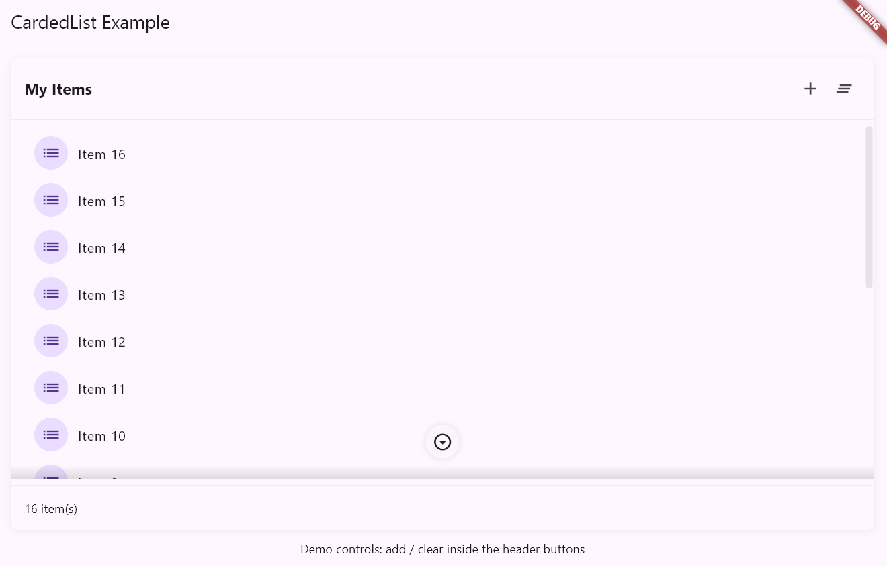

<!--
This README describes the package. If you publish this package to pub.dev,
this README's contents appear on the landing page for your package.

For information about how to write a good package README, see the guide for
[writing package pages](https://dart.dev/tools/pub/writing-package-pages).

For general information about developing packages, see the Dart guide for
[creating packages](https://dart.dev/guides/libraries/create-packages)
and the Flutter guide for
[developing packages and plugins](https://flutter.dev/to/develop-packages).
-->

[](https://github.com/Rediflow-AI/Shadow_Carded_List/blob/main/LICENSE)
[](https://pub.dev/packages/shadowed_carded_list)

# shadowed_carded_list

Lightweight Flutter package that provides a polished card-style container
with a shadowed, scrollable list area. The package includes a small set of
UI helpers (a tertiary icon button) and an example app demonstrating usage.

This package is intended for apps that need a reusable, visually consistent
carded list with subtle shadow gradients and a convenient scroll-to-bottom
control.

## Features

- Carded container with configurable decoration and spacing
- Shadowed scroll area with top/bottom fade shadows that appear when
  content overflows
- Optional scroll-to-bottom control (tertiary icon button)
- Empty-list messaging
- Small, dependency-free API suitable for publishing to pub.dev

## Quick example

```dart
import 'package:shadowed_carded_list/shadowed_carded_list.dart';
import 'package:flutter/material.dart';

class Example extends StatelessWidget {
  @override
  Widget build(BuildContext context) {
    final items = List.generate(10, (i) => 'Item ${i + 1}');

    return CardedList<String>(
      header: const Text('My list'),
      footer: Text('${items.length} items'),
      items: items,
      itemBuilder: (context, index) => ListTile(title: Text(items[index])),
    );
  }
}
```

## Getting started

1. Add the package to your `pubspec.yaml`:

```yaml
dependencies:
  shadowed_carded_list: ^0.1.0
```

2. Import the package and use `CardedList` as shown in the quick example.

## API

Public symbols exported from the package:

- `CardedList<T>` — Primary widget. Key parameters:
  - `header`: required header widget
  - `footer`: optional footer widget
  - `items`: required `List<T>` of items
  - `itemBuilder`: required builder `(BuildContext, int) -> Widget?`
  - `emptyListMessage`: optional text shown when list is empty
  - `cardDecoration`, `headerPadding`, `spacing` for styling

- `ShadowedScrollableList<T>` — Lower-level widget if you need the scroll
  region without the outer card.

- `TertiaryIconButton` — Small circular icon control used by the
  scroll-to-bottom behavior.

See the `example/` folder for a working demo.

## Example app

Run the example app to see the widget in action:

```bash
cd example
flutter pub get
flutter run
```

## Contributing

Contributions are welcome. Please open issues for bugs and feature requests
and send pull requests for improvements. Follow the repository coding style
and include tests where possible.

## License

This project includes a `LICENSE` file in the repository root. By
contributing you agree to the terms of that license.

---
Package maintained by Rediflow AI.

## Advanced usage

You can customize the appearance and behavior of `CardedList` and the
inner `ShadowedScrollableList` using the following examples.

- Custom card decoration and spacing:

```dart
CardedList<String>(
  header: Text('Users'),
  items: users,
  cardDecoration: BoxDecoration(
    color: Colors.white,
    borderRadius: BorderRadius.circular(12),
    boxShadow: [BoxShadow(color: Colors.black12, blurRadius: 12)],
  ),
  headerPadding: EdgeInsets.symmetric(horizontal: 20, vertical: 18),
  spacing: 12,
  itemBuilder: (c, i) => ListTile(title: Text(users[i])),
)
```

- Using `ShadowedScrollableList` standalone (no outer card):

```dart
ShadowedScrollableList<String>(
  items: items,
  listBuilder: (c, i) => Text(items[i]),
  shadowSize: 18.0,
  showScrollbar: true,
)
```

## Screenshots

Preview images are included as placeholders in `assets/screenshots/`.
Replace them with your own screenshots for documentation or the package
page on pub.dev.



## Publishing checklist

Before publishing to pub.dev:

1. Remove `publish_to: 'none'` from `pubspec.yaml`.
2. Bump the package version in `pubspec.yaml`.
3. Run the publish dry-run locally (see `PUBLISHING.md` for exact steps).

---
